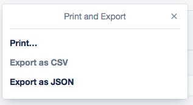

# Trello Attachement Download

Downloads Trello attachements into the same folder as the Exported JSON file.

## Instructions

Export Trello JSON

Run the command

`go run main.go path-to-json-file`
or
`./binary path-to-json-file`

## Testing
* You can use the subnautica boards for testing: https://trello.com/b/yxoJrFgP/subnautica-development
